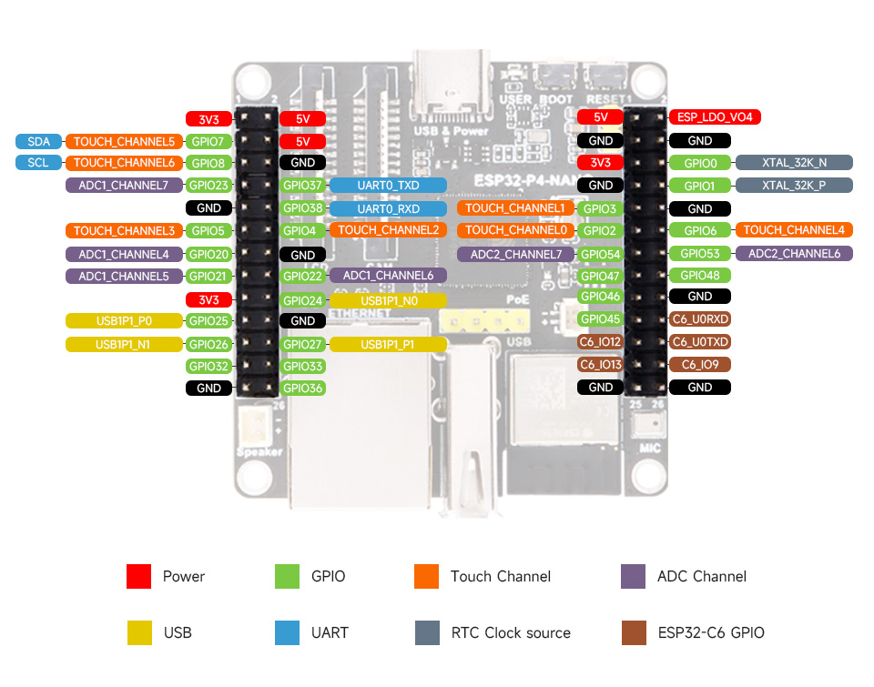

# Firmware Images

Prebuilt application binaries for the ESP32-P4 OpENer EtherNet/IP project. The
images in this directory target the **WaveShare ESP32-P4-NANO** board (with or
without the PoE module) and include:

- OpENer EtherNet/IP adapter with static/DHCP IP selection and Custom ACD
  timings (200 ms probe cycle, four announcements at 2 s interval).
- VL53L1X Time-of-Flight sensor task pinned to core 1, populating Input
  Assembly 100 bytes 0-8 (distance, status, ambient, signal per SPAD, SPAD
  count).
- OpENer, lwIP, and Ethernet stack pinned to core 0 with deferred static IP
  assignment and conflict handling.
- GPIO33 output assembly control (bit 0 of Output Assembly 150) for the status
  LED.
- Configurable TCP/IP settings persisted in NVS via CIP attributes.
- Builds produced with ESP-IDF v5.5 toolchain.
- Sensor I²C defaults wired for the WaveShare board: SDA **GPIO 7**, SCL
  **GPIO 8** (configurable via Kconfig).

## Files

- `ESP32-P4-OpENerEIP.bin` – Production application image (load at
  `0x00010000`). Build timestamp matches the latest `build/` output.
- (Bootloader and partition table images are generated by ESP-IDF on demand and
  can be found in the `build/bootloader/` and `build/partition_table/`
  directories if needed.)

## Flashing Instructions

1. Install ESP-IDF v5.5 (or later) and ensure `idf.py` is on your PATH.
2. Connect the WaveShare ESP32-P4-NANO via USB (default USB-serial JTAG
   interface).
3. Clone this repository and open a terminal in the project root.
4. Run the following command to flash the firmware:

   ```bash
   idf.py -p <PORT> flash
   ```

   Replace `<PORT>` with the COM port (Windows) or `/dev/ttyACM*`
   (Linux/macOS). The command automatically flashes the bootloader,
   partition table, and `ESP32-P4-OpENerEIP.bin` image.

5. To flash only the application binary from this directory:

   ```bash
   idf.py -p <PORT> app-flash
   ```

   or use `esptool.py` directly:

   ```bash
   esptool.py --chip esp32p4 --port <PORT> --baud 921600 write_flash \
     0x00010000 FirmwareImages/ESP32-P4-OpENerEIP.bin
   ```

6. Open the serial monitor for logs:

   ```bash
   idf.py -p <PORT> monitor
   ```

   Press `Ctrl+]` to exit.

## Board Pinout Reference



## Post-Flash Checklist

- Confirm Ethernet link comes up (logs show `ethernet_event: ETH_EVENT_LINK_UP`).
- Verify DHCP/static IP configuration via CIP (TCP/IP Interface object
  attributes) or serial log.
- Check VL53L1X sensor output in Input Assembly 100 via EtherNet/IP client.
- Toggle Output Assembly 150 bit 0 to drive the status LED on GPIO33.

For development builds, rebuild via `idf.py build` and copy the resulting
`build/ESP32-P4-OpENerEIP.bin` into this folder if distribution to other
systems is required.

