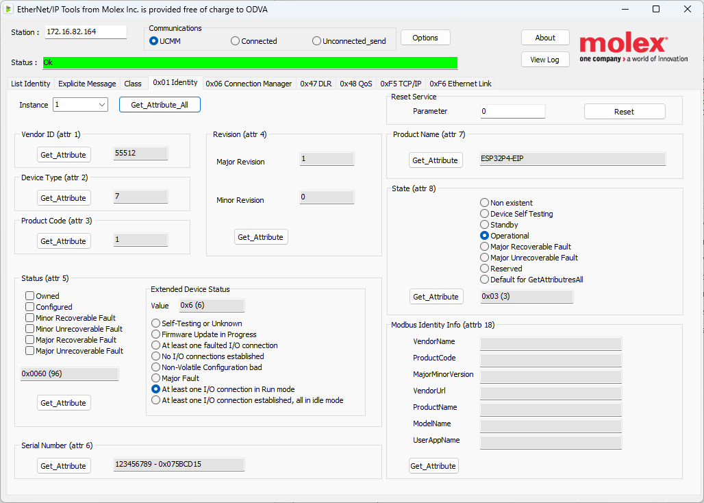
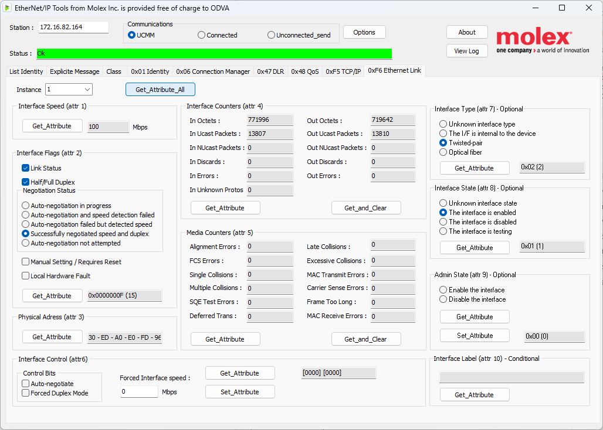
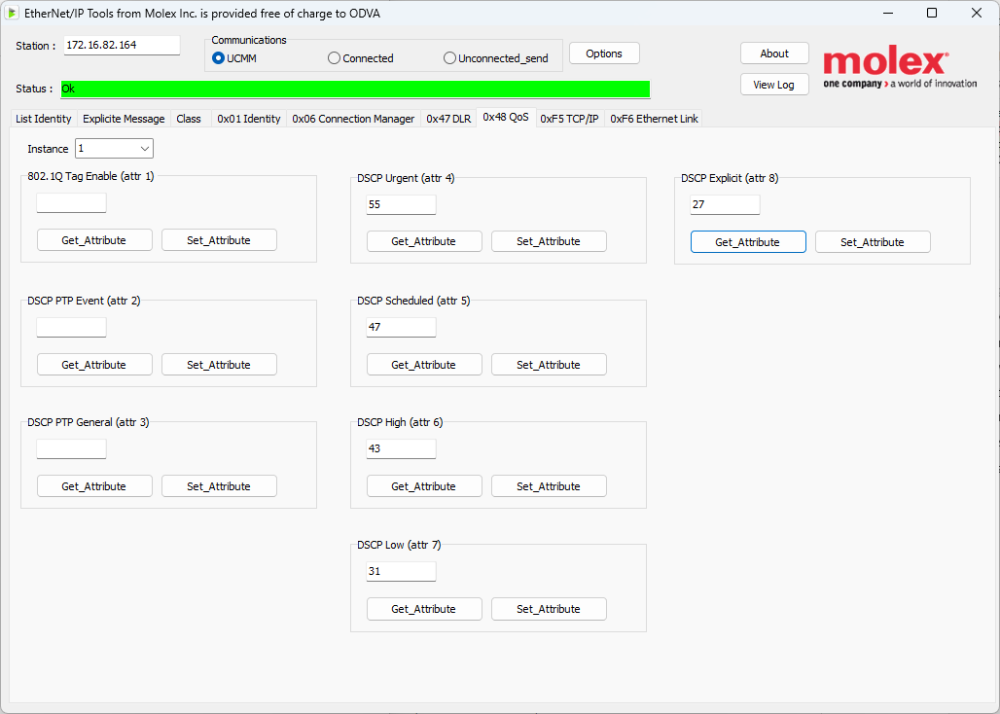
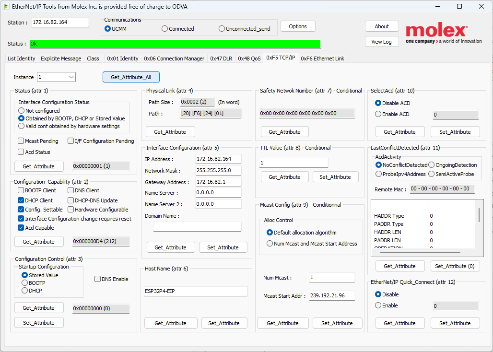

# ESP32-P4 OpENer Integration

## Overview
- Port of the OpENer EtherNet/IP™ stack to Espressif’s ESP32-P4 using ESP-IDF v5.5
- Runs the canonical sample application with cyclic I/O assemblies and class 1/3 messaging support
- Integrates with `esp_netif` and the ESP32 Ethernet MAC/PHY driver for link management and address assignment

## Peripheral Component Libraries
- **BMI270 – 6-axis IMU**  
  Motion sensing and orientation detection using Bosch’s BMI270; includes accelerometer and gyroscope pipelines. [Datasheet](https://www.bosch-sensortec.com/media/boschsensortec/downloads/datasheets/bst-bmi270-ds000.pdf)
- **BNO086 – 9-axis IMU / sensor fusion hub**  
  Absolute orientation with integrated sensor fusion algorithms from Hillcrest Labs / CEVA. [Datasheet](https://www.ceva-dsp.com/wp-content/uploads/2019/10/BNO080_085-Datasheet.pdf)
- **74HC165 – parallel-in serial-out shift register**  
  Expands digital inputs by latching eight GPIOs and shifting them over SPI-style serial. [Datasheet](https://www.ti.com/lit/ds/symlink/sn74hc165.pdf)
- **74HC595 – serial-in parallel-out shift register**  
  Provides eight latched digital outputs controlled through a serial interface. [Datasheet](https://www.ti.com/lit/ds/symlink/sn74hc595.pdf)
- **HX711 – 24-bit load-cell ADC**  
  Precision differential ADC for strain gauges and weigh-scale applications. [Datasheet](https://www.mouser.com/datasheet/2/813/hx711_english-1022875.pdf)
- **LSM6DSV16X – 6-axis IMU with machine-learning core**  
  ST MEMS accelerometer and gyroscope supporting advanced gesture and vibration features. [Datasheet](https://www.st.com/resource/en/datasheet/lsm6dsv16x.pdf)
- **MCP23008 – 8-bit I²C GPIO expander**  
  Adds eight general purpose digital I/O lines via I²C with configurable pull-ups. [Datasheet](https://ww1.microchip.com/downloads/en/DeviceDoc/21919e.pdf)
- **MCP23017 – 16-bit I²C GPIO expander**  
  Two-bank GPIO expander with interrupt-on-change and polarity inversion. [Datasheet](https://ww1.microchip.com/downloads/en/devicedoc/20001952c.pdf)
- **MCP3008 – 10-bit SPI ADC**  
  Eight-channel single-ended or four-channel differential analog-to-digital converter. [Datasheet](https://ww1.microchip.com/downloads/en/devicedoc/21295d.pdf)
- **MCP3208 – 12-bit SPI ADC**  
  Higher-resolution variant of the MCP3008 for single-ended or differential sensing. [Datasheet](https://ww1.microchip.com/downloads/en/DeviceDoc/21298c.pdf)
- **MCP4725 – 12-bit I²C DAC**  
  Digital-to-analog converter with EEPROM for storing default output voltage. [Datasheet](https://ww1.microchip.com/downloads/en/DeviceDoc/22039d.pdf)
- **NAU7802 – 24-bit bridge ADC**  
  Dual-channel ADC with PGA for load-cell and precision measurement front ends. [Datasheet](https://www.nuvoton.com/export/resource-files/DS_NAU7802_EN_Rev1.7.pdf)
- **PCF8574 – 8-bit I²C GPIO expander**  
  Open-drain remote I/O extension suitable for keypads and LED drivers. [Datasheet](https://www.nxp.com/docs/en/data-sheet/PCF8574_PCF8574A.pdf)
- **PCF8575 – 16-bit I²C GPIO expander**  
  Double-width variant providing 16 quasi-bidirectional I/O pins. [Datasheet](https://www.nxp.com/docs/en/data-sheet/PCF8575.pdf)
- **TCA9534 – 8-bit I²C GPIO expander**  
  TI digital port expander with interrupt support and low-power operation. [Datasheet](https://www.ti.com/lit/ds/symlink/tca9534.pdf)
- **TCA9555 – 16-bit I²C GPIO expander**  
  Adds two 8-bit ports with configurable direction and interrupt lines. [Datasheet](https://www.ti.com/lit/ds/symlink/tca9555.pdf)
- **VL53L0X – time-of-flight distance sensor**  
  Measures absolute distance up to two meters using ST’s FlightSense technology. [Datasheet](https://www.st.com/resource/en/datasheet/vl53l0x.pdf)

## Enabled EtherNet/IP Objects
- **Class 0x02 – Message Router**  
  Core message dispatch services for all explicit requests.
- **Class 0x01 – Identity**  
  Full support for state transitions (Startup → Standby → Operational), recoverable/unrecoverable fault flags, Run/Idle header control bits, device reset service (Type 0 and Type 1), and the standard identity attributes (Vendor ID `55512`, Device Type `7`, Product Code `1`, Product Name `ESP32P4-EIP`).
- **Class 0xF5 – TCP/IP Interface**  
  DHCP/static configuration, multicast settings (attribute 9), encapsulation inactivity timeout (attribute 13), and persistence through NVS.
- **Class 0xF6 – Ethernet Link**  
  Negotiated speed/duplex reporting, physical MAC address, interface and media counters, interface type/state, and optional admin control.
- **Class 0x06 – Connection Manager**  
  Enables class 1 cyclic I/O and class 3 explicit messaging channels.
- **Class 0x04 – Assemblies**  
  Input (`100`), output (`150`), and configuration (`151`) data sets for the sample application.
- **Class 0x48 – Quality of Service**  
  Default DSCP priorities (Urgent 55, Scheduled 47, High 43, Low 31, Explicit 27); attributes 1–3 remain read-only in this port.
- **Class 0x47 – Device Level Ring**  
  Present in the code base but **not** instantiated on this platform because the ESP32-P4 design has only a single Ethernet port and lacks the dual-MAC hardware required for ring supervision.

## I/O Assemblies
- `Input Assembly 100` (`g_assembly_data064`, 32 bytes): produced data for originators; updated by the sample application logic
- `Output Assembly 150` (`g_assembly_data096`, 32 bytes): consumed data written by originators; updates can trigger local actions
- `Configuration Assembly 151` (`g_assembly_data097`, 10 bytes): optional per-connection configuration image
- Exclusive Owner, Input Only, and Listen Only connection points are pre-configured for assembly 100/150/151 triplets
- Run/Idle headers for both O→T and T→O traffic are disabled by default (can be re-enabled if required)

## Network Configuration
- Defaults to DHCP when no persisted configuration is present or if the stored static profile fails validation
- Supports static addressing through CIP attribute writes:
  - Attribute 3 (`config_control`) selects DHCP (`0x02`) or static (`0x00`) mode
  - Attribute 5 (`interface_configuration`) carries the static IP, mask, gateway, and DNS values
- Hostname (attribute 6) and domain name storage comply with RFC 1123 length limits and input validation
- Encapsulation inactivity timeout (attribute 13) constrained to 0–3600 seconds per spec
- DNS servers propagated to `esp_netif` whenever non-zero in the CIP structure
- All settings persist in NVS (`namespace: opener`, key `tcpip_cfg`) via `NvTcpipStore()`/`NvTcpipLoad()`
- Invalid or partially populated static entries are rejected, clearing the interface back to DHCP and resetting unresolved ACD status bits

## Runtime Integration Notes
- Ethernet link events from `esp_event` update the Identity object’s state and clear/set recoverable fault flags
- GPIO33 is configured as a status LED drive and is toggled from the output assembly (bit 0 of assembly 150)
- Mutex-protected `struct netif*` handle allows the sample application and OpENer to share the active lwIP netif
- Encapsulation layer uses OpENer’s standard socket abstraction and ESP32 FreeRTOS tasks for TCP/UDP servicing

## Example Object Views
- Identity object instance 1 (`0x01/1`) as displayed in Molex EtherNet/IP Tools, showing the operational state and extended status `0x06`:  
  
- Ethernet Link object (`0xF6/1`) reporting 100 Mbps twisted-pair link, auto-negotiation results, interface counters, and MAC address `30:ED:A0:E0:FD:96`:  
  
- Quality of Service object (`0x48/1`) with default DSCP values; note that attributes 1–3 (802.1Q enable and PTP DSCP overrides) are read-only in this port:  
  
- TCP/IP Interface object (`0xF5/1`) reflecting the current network settings, stored configuration control, multicast allocation, and ACD disabled at boot:  
  

## Work in Progress
- Address Conflict Detection (ACD) per RFC 5227 is under active development; the lwIP module is present but intentionally disabled at boot until integration refinements are complete. Expect updated guidance before enabling ACD in the field.

## Hardware Under Test
- All bring-up and validation have been performed on a Waveshare ESP32-P4-NANO with PoE module ([product page](https://www.waveshare.com/esp32-p4-nano.htm?sku=29028)).

## Next Steps
- Integrate I²C port expanders (e.g., MCP23008/MCP23017) to provide additional opto-isolated digital I/O for industrial deployments. The plan is to probe the I²C bus at boot, identify the connected expanders, and automatically bind their GPIO lines to CIP Assembly instances.

