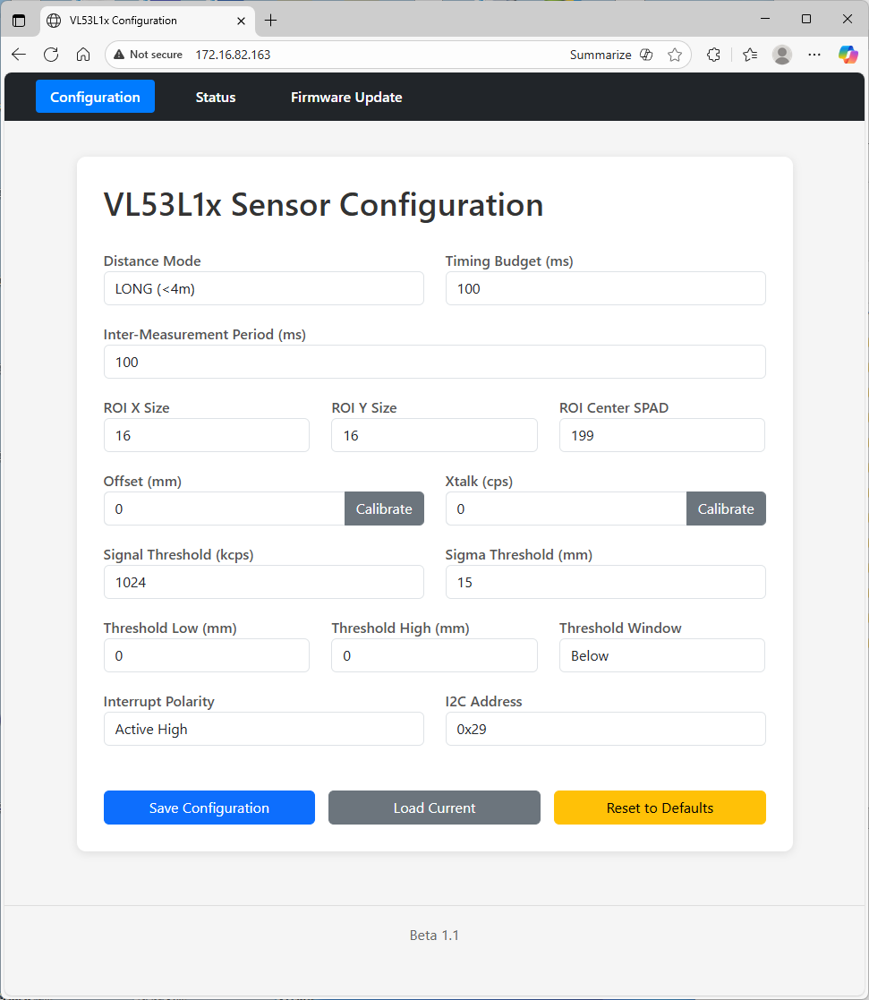

# ESP32-P4 OpENer Integration

## Overview
- Port of the OpENer EtherNet/IP™ stack to Espressif’s ESP32-P4 using ESP-IDF v5.5
- Runs the canonical sample application with cyclic I/O assemblies and class 1/3 messaging support
- Integrates with `esp_netif` and the ESP32 Ethernet MAC/PHY driver for link management and address assignment
- Implements static-IP Address Conflict Detection (ACD) for EtherNet/IP adapters while keeping DHCP compatibility

## Peripheral Component Libraries
- **BMI270 – 6-axis IMU**  
  Motion sensing and orientation detection using Bosch’s BMI270; includes accelerometer and gyroscope pipelines. [Datasheet](https://www.bosch-sensortec.com/media/boschsensortec/downloads/datasheets/bst-bmi270-ds000.pdf)
- **BNO086 – 9-axis IMU / sensor fusion hub**  
  Absolute orientation with integrated sensor fusion algorithms from Hillcrest Labs / CEVA. [Datasheet](https://www.ceva-dsp.com/wp-content/uploads/2019/10/BNO080_085-Datasheet.pdf)
- **74HC165 – parallel-in serial-out shift register**  
  Expands digital inputs by latching eight GPIOs and shifting them over SPI-style serial. [Datasheet](https://www.ti.com/lit/ds/symlink/sn74hc165.pdf)
- **74HC595 – serial-in parallel-out shift register**  
  Provides eight latched digital outputs controlled through a serial interface. [Datasheet](https://www.ti.com/lit/ds/symlink/sn74hc595.pdf)
- **HX711 – 24-bit load-cell ADC**  
  Precision differential ADC for strain gauges and weigh-scale applications. [Datasheet](https://www.mouser.com/datasheet/2/813/hx711_english-1022875.pdf)
- **LSM6DSV16X – 6-axis IMU with machine-learning core**  
  ST MEMS accelerometer and gyroscope supporting advanced gesture and vibration features. [Datasheet](https://www.st.com/resource/en/datasheet/lsm6dsv16x.pdf)
- **MCP23008 – 8-bit I²C GPIO expander**  
  Adds eight general purpose digital I/O lines via I²C with configurable pull-ups. [Datasheet](https://ww1.microchip.com/downloads/en/DeviceDoc/21919e.pdf)
- **MCP23017 – 16-bit I²C GPIO expander**  
  Two-bank GPIO expander with interrupt-on-change and polarity inversion. [Datasheet](https://ww1.microchip.com/downloads/en/devicedoc/20001952c.pdf)
- **MCP3008 – 10-bit SPI ADC**  
  Eight-channel single-ended or four-channel differential analog-to-digital converter. [Datasheet](https://ww1.microchip.com/downloads/en/devicedoc/21295d.pdf)
- **MCP3208 – 12-bit SPI ADC**  
  Higher-resolution variant of the MCP3008 for single-ended or differential sensing. [Datasheet](https://ww1.microchip.com/downloads/en/DeviceDoc/21298c.pdf)
- **MCP4725 – 12-bit I²C DAC**  
  Digital-to-analog converter with EEPROM for storing default output voltage. [Datasheet](https://ww1.microchip.com/downloads/en/DeviceDoc/22039d.pdf)
- **NAU7802 – 24-bit bridge ADC**  
  Dual-channel ADC with PGA for load-cell and precision measurement front ends. [Datasheet](https://www.nuvoton.com/resource-files/NAU7802%20Data%20Sheet%20V1.7.pdf)
- **PCF8574 – 8-bit I²C GPIO expander**  
  Open-drain remote I/O extension suitable for keypads and LED drivers. [Datasheet](https://www.nxp.com/docs/en/data-sheet/PCF8574_PCF8574A.pdf)
- **PCF8575 – 16-bit I²C GPIO expander**  
  Double-width variant providing 16 quasi-bidirectional I/O pins. [Datasheet](https://www.nxp.com/docs/en/data-sheet/PCF8575.pdf)
- **TCA9534 – 8-bit I²C GPIO expander**  
  TI digital port expander with interrupt support and low-power operation. [Datasheet](https://www.ti.com/lit/ds/symlink/tca9534.pdf)
- **TCA9555 – 16-bit I²C GPIO expander**  
  Adds two 8-bit ports with configurable direction and interrupt lines. [Datasheet](https://www.ti.com/lit/ds/symlink/tca9555.pdf)
- **VL53L0X – time-of-flight distance sensor**  
  Measures absolute distance up to two meters using ST's FlightSense technology. [Datasheet](https://www.st.com/resource/en/datasheet/vl53l0x.pdf)
- **VL53L1X – long-range time-of-flight distance sensor**  
  Measures absolute distance up to four meters using ST's FlightSense technology with enhanced signal processing. [Datasheet](https://www.st.com/resource/en/datasheet/vl53l1x.pdf)

## VL53L1X Sensor Integration

The VL53L1X ToF sensor is integrated into the EtherNet/IP input assembly, providing real-time distance measurements and sensor status information to connected PLCs.

### Sensor Configuration

- **I2C Interface**: Configurable via Kconfig (`CONFIG_OPENER_I2C_SCL_GPIO`, `CONFIG_OPENER_I2C_SDA_GPIO`) – defaults: SCL **GPIO 8**, SDA **GPIO 7**
- **Default I2C Address**: `0x29`
- **Update Rate**: 10 Hz (100ms intervals)
- **Distance Mode**: Long range (up to 4 meters)
- **Task Core**: Core 1 (OpENer and lwIP run on Core 0)

### Startup Behaviour When the Sensor Is Missing

- If the VL53L1X probe sequence fails (for example, the sensor is absent or wired incorrectly), the ToF task logs `VL53L1x initialization failed`, cleans up, and exits.
- Input Assembly 100 bytes 0-8 remain at zero because no measurements are produced after the task stops.
- All other EtherNet/IP functionality—TCP/IP, assemblies, Connection Manager diagnostics, and GPIO33 LED control—continues to operate normally.
- Restoring sensor functionality requires fixing the hardware issue and rebooting so the initialization task can run again.

### Input Assembly Byte Layout

Sensor data is written to bytes 0-8 of Input Assembly 100 (`g_assembly_data064`) in little-endian format:

| Byte(s) | Data Type | Description | Units | Valid Range |
|---------|-----------|-------------|-------|-------------|
| 0-1 | `uint16_t` | **Distance** | millimeters (mm) | 0-4000 mm (0 = no target) |
| 2 | `uint8_t` | **Status** | Range status code | 0 = valid, see status codes below |
| 3-4 | `uint16_t` | **Ambient** | Ambient light level | kcps (kilo counts per second) |
| 5-6 | `uint16_t` | **SigPerSPAD** | Signal per SPAD | kcps/SPAD |
| 7-8 | `uint16_t` | **NumSPADs** | Number of enabled SPADs | count (typically 16-64) |

**Note:** Bytes 9-31 of the input assembly are available for other application data and are not overwritten by the sensor task.

### Range Status Codes

| Code | Description |
|------|-------------|
| 0 | No error (valid measurement) |
| 1 | Sigma failed (measurement uncertainty too high) |
| 2 | Signal failed (signal too weak) |
| 3 | Target out of range |
| 4 | Signal failed |
| 5 | Range valid but wrapped |
| 6 | Target out of range |
| 7 | Wrap-around (target beyond max range) |
| 9-13 | Range valid but wrapped |
| 255 | Invalid/unknown status |

### PLC Integration Example (Allen-Bradley Micro850)

For Structured Text conversion from SINT array to sensor variables:

```structured_text
PROGRAM VL53L1x_Sensor_Data
VAR
    ESP32p4_I : ARRAY[0..31] OF SINT;
    Distance_mm : UINT;
    Status : UINT;
    Ambient_kcps : UINT;
    SigPerSPAD_kcps : UINT;
    NumSPADs : UINT;
    ByteLow : BYTE;
    ByteHigh : BYTE;
END_VAR

// Convert Distance (bytes 0-1, little-endian)
ByteLow := ANY_TO_BYTE(ESP32p4_I[0]);
ByteHigh := ANY_TO_BYTE(ESP32p4_I[1]);
Distance_mm := ANY_TO_UINT(ByteLow) + ((ANY_TO_UINT(ByteHigh) * 256));

// Extract Status (byte 2)
ByteLow := ANY_TO_BYTE(ESP32p4_I[2]);
Status := ANY_TO_UINT(ByteLow);

// Convert Ambient (bytes 3-4, little-endian)
ByteLow := ANY_TO_BYTE(ESP32p4_I[3]);
ByteHigh := ANY_TO_BYTE(ESP32p4_I[4]);
Ambient_kcps := ANY_TO_UINT(ByteLow) + ((ANY_TO_UINT(ByteHigh) * 256));

// Convert SigPerSPAD (bytes 5-6, little-endian)
ByteLow := ANY_TO_BYTE(ESP32p4_I[5]);
ByteHigh := ANY_TO_BYTE(ESP32p4_I[6]);
SigPerSPAD_kcps := ANY_TO_UINT(ByteLow) + ((ANY_TO_UINT(ByteHigh) * 256));

// Convert NumSPADs (bytes 7-8, little-endian)
ByteLow := ANY_TO_BYTE(ESP32p4_I[7]);
ByteHigh := ANY_TO_BYTE(ESP32p4_I[8]);
NumSPADs := ANY_TO_UINT(ByteLow) + ((ANY_TO_UINT(ByteHigh) * 256));
END_PROGRAM
```

### Sensor Data Interpretation

- **Distance_mm**: Valid range is typically 50-4000 mm. Values of 0 usually indicate no target detected or out of range.
- **Status**: Always check `Status = 0` before using distance values. Non-zero values indicate measurement errors or out-of-range conditions.
- **Ambient_kcps**: Higher values indicate brighter ambient light, which may affect measurement accuracy.
- **SigPerSPAD_kcps**: Higher values indicate stronger return signal. Values > 100 kcps/SPAD typically indicate good signal quality.
- **NumSPADs**: Number of active SPADs used for measurement. Typically ranges from 16-64 depending on configuration.

For detailed sensor API documentation, see [components/vl53l1x_uld/README.md](components/vl53l1x_uld/README.md).

## Web Configuration Interface

The device includes a built-in web server (port 80) providing a user-friendly interface for sensor configuration, real-time status monitoring, and firmware management.

### Accessing the Web Interface

- **URL**: `http://<device-ip-address>` (e.g., `http://192.168.1.100`)
- **Port**: 80 (HTTP)
- **Navigation**: Top menu bar provides access to Configuration, Status, and Firmware Update pages

### Configuration Page

The Configuration page (`/`) allows you to configure all VL53L1X sensor parameters:



#### Distance Mode Settings
- **Distance Mode**: SHORT (<1.3m) or LONG (<4m, default)
- **Timing Budget**: 15, 20, 33, 50, 100 (default), 200, or 500 ms
- **Inter-Measurement Period**: Minimum 15 ms, must be ≥ timing budget (default: 100 ms)

#### Region of Interest (ROI) Settings
- **ROI X Size**: 4-16 (default: 16)
- **ROI Y Size**: 4-16 (default: 16)
- **ROI Center SPAD**: 0-199 (default: 199 = center)

#### Calibration Settings
- **Offset (mm)**: -128 to +127 mm (default: 0)
  - Use "Calibrate" button to perform offset calibration at a known target distance
- **Xtalk (cps)**: 0-65535 cps (default: 0)
  - Use "Calibrate" button to perform crosstalk calibration

#### Threshold Settings
- **Signal Threshold (kcps)**: 0-65535 kcps (default: 1024)
- **Sigma Threshold (mm)**: 0-65535 mm (default: 15)
- **Threshold Low (mm)**: 0-4000 mm (default: 0 = disabled)
- **Threshold High (mm)**: 0-4000 mm (default: 0 = disabled)
- **Threshold Window**: Below, Above, Out, or In (default: Below)

#### Advanced Settings
- **Interrupt Polarity**: Active Low or Active High (default: Active High)
- **I2C Address**: 0x29-0x7F (default: 0x29)

#### Configuration Management
- **Save Configuration**: Saves current settings to NVS (persists across reboots)
- **Load Current**: Reloads the current configuration from NVS
- **Reset to Defaults**: Restores factory default values

All configuration changes are validated before saving and are immediately applied to the sensor if it is initialized.

### Status Page

The Status page (`/status`) provides real-time sensor readings and visualization:

#### Current Readings
- **Distance (mm)**: Current measured distance
- **Status**: Range status code (0 = valid)
- **Ambient (kcps)**: Ambient light level
- **Signal per SPAD (kcps/SPAD)**: Signal strength per SPAD
- **Number of SPADs**: Active SPAD count

#### Distance Over Time Chart
- Interactive rolling line chart showing distance measurements over time
- Displays the last 60 data points
- Updates every 250 ms
- Time-axis labels show measurement timestamps

### Firmware Update Page

The Firmware Update page (`/ota`) enables over-the-air (OTA) firmware updates:

#### Update Process
1. **Select Firmware File**: Click "Choose File" and select a `.bin` firmware file
2. **Start Update**: Click "Start Update" to begin the upload
3. **Progress**: The firmware is streamed to the device with progress tracking
4. **Completion**: After successful upload, the device automatically reboots into the new firmware

#### Update Requirements
- Firmware file must be a valid ESP-IDF binary (`.bin` format)
- Maximum file size: 2 MB
- Device must have sufficient free space in the OTA partition
- The device will automatically mark the new firmware as valid after reboot

#### Post-Update Behavior
- After reboot, the device validates the new firmware
- If validation fails, the device automatically rolls back to the previous firmware
- Successful updates persist across power cycles

### Web API Endpoints

The web server exposes RESTful API endpoints for programmatic access:

#### Configuration API
- **GET `/api/config`**: Retrieve current sensor configuration (JSON)
- **POST `/api/config`**: Update sensor configuration (JSON body)

#### Status API
- **GET `/api/status`**: Get current sensor readings (JSON)
- **GET `/api/assemblies`**: Get EtherNet/IP assembly data (JSON)

#### Calibration API
- **POST `/api/calibrate/offset`**: Perform offset calibration
  - Body: `{"target_distance_mm": <value>}`
  - Returns: `{"offset_mm": <calculated_offset>}`
- **POST `/api/calibrate/xtalk`**: Perform crosstalk calibration
  - Body: `{"target_distance_mm": <value>}`
  - Returns: `{"xtalk_cps": <calculated_xtalk>}`

#### OTA API
- **POST `/api/ota/update`**: Upload firmware file (multipart/form-data)
- **GET `/api/ota/status`**: Get OTA update status and progress

## Modbus TCP Implementation

The device includes a Modbus TCP server implementation that provides access to EtherNet/IP assembly data via the standard Modbus protocol.

### Modbus TCP Server

- **Port**: 502 (standard Modbus TCP port)
- **Protocol**: Modbus TCP/IP (Modbus over TCP)
- **Max Connections**: 5 concurrent clients
- **Endianness**: Big-endian (Modbus standard)

### Register Mapping

The Modbus register map mirrors the EtherNet/IP assemblies:

#### Input Registers (Read-Only)
- **Address Range**: 0-15 (16 registers = 32 bytes)
- **Maps to**: Input Assembly 100 (`g_assembly_data064`)
- **Function Code**: 04 (Read Input Registers)

**Register Layout:**
| Register | Assembly Bytes | Description |
|----------|----------------|-------------|
| 0 | 0-1 | Distance (mm), 16-bit value |
| 1 | 2-3 | Status (byte 2) + Ambient low byte (byte 3) |
| 2 | 4-5 | Ambient high byte (byte 4) + Signal per SPAD low (byte 5) |
| 3 | 6-7 | Signal per SPAD high (byte 6) + Number of SPADs low (byte 7) |
| 4 | 8-9 | Number of SPADs high (byte 8) + Reserved (byte 9) |
| 5-15 | 10-31 | Reserved/application data |

**Note:** The mapping is byte-aligned, so some sensor fields span multiple registers. For convenience, you can read registers 0-4 to get all sensor data (distance, status, ambient, signal per SPAD, number of SPADs).

#### Holding Registers (Read-Write)

**Output Assembly Mapping (Registers 100-115)**
- **Address Range**: 100-115 (16 registers = 32 bytes)
- **Maps to**: Output Assembly 150 (`g_assembly_data096`)
- **Function Codes**: 03 (Read Holding Registers), 06 (Write Single Register), 16 (Write Multiple Registers)

**Configuration Assembly Mapping (Registers 150-154)**
- **Address Range**: 150-154 (5 registers = 10 bytes)
- **Maps to**: Configuration Assembly 151 (`g_assembly_data097`)
- **Function Codes**: 03 (Read Holding Registers), 06 (Write Single Register), 16 (Write Multiple Registers)

### Endianness Conversion

The implementation automatically handles endianness conversion:
- **EtherNet/IP Assemblies**: Store data in little-endian format (LSB first)
- **Modbus TCP**: Transmits data in big-endian format (MSB first)
- **Conversion**: Performed automatically during read/write operations

### Example Modbus Client Usage

#### Reading Distance (Input Register 0)
```python
from pymodbus.client import ModbusTcpClient

client = ModbusTcpClient('192.168.1.100', port=502)
client.connect()

# Read distance (register 0, 16-bit value in big-endian format)
result = client.read_input_registers(0, 1, unit=1)
if not result.isError():
    # pymodbus automatically converts big-endian bytes to integer
    distance = result.registers[0]
    print(f"Distance: {distance} mm")
```

#### Writing LED Control (Holding Register 100)
```python
# Write to Output Assembly 150, bit 0 (LED control)
# Register 100 = first 16 bits of Output Assembly 150
result = client.write_register(100, 0x0001, unit=1)  # Turn LED on
```

### Supported Modbus Function Codes

| Function Code | Name | Description | Supported |
|---------------|------|-------------|-----------|
| 03 | Read Holding Registers | Read holding registers (100-115, 150-154) | Yes |
| 04 | Read Input Registers | Read input registers (0-15) | Yes |
| 06 | Write Single Register | Write single holding register | Yes |
| 16 | Write Multiple Registers | Write multiple holding registers | Yes |

### Thread Safety

All register access is protected by mutexes to ensure thread-safe operation when accessed concurrently from:
- EtherNet/IP cyclic I/O connections
- Modbus TCP clients
- Internal sensor task updates

## Enabled EtherNet/IP Objects
- **Class 0x02 – Message Router**  
  Core message dispatch services for all explicit requests.
- **Class 0x01 – Identity**  
  Full support for state transitions (Startup → Standby → Operational), recoverable/unrecoverable fault flags, Run/Idle header control bits, device reset service (Type 0 and Type 1), and the standard identity attributes (Vendor ID `55512`, Device Type `7`, Product Code `1`, Product Name `ESP32P4-EIP`).
- **Class 0xF5 – TCP/IP Interface**  
  DHCP/static configuration, multicast settings (attribute 9), encapsulation inactivity timeout (attribute 13), and persistence through NVS.
- **Class 0xF6 – Ethernet Link**  
  Negotiated speed/duplex reporting, physical MAC address, interface and media counters, interface type/state, and optional admin control.
- **Class 0x06 – Connection Manager**  
  Enables class 1 cyclic I/O and class 3 explicit messaging channels. Attribute 11 (CPU Utilization) is intentionally fixed at `0` on this platform because FreeRTOS statistics fluctuate too much for a reliable percentage. Buffer attributes 12/13 report the static 4096‑byte defaults used by OpENer.
- **Class 0x04 – Assemblies**  
  Input (`100`), output (`150`), and configuration (`151`) data sets for the sample application.
- **Class 0x48 – Quality of Service**  
  Default DSCP priorities (Urgent 55, Scheduled 47, High 43, Low 31, Explicit 27); attributes 1–3 remain read-only in this port.
- **Class 0x47 – Device Level Ring**  
  Present in the code base but **not** instantiated on this platform because the ESP32-P4 design has only a single Ethernet port and lacks the dual-MAC hardware required for ring supervision.

## I/O Assemblies
- `Input Assembly 100` (`g_assembly_data064`, 32 bytes): produced data for originators; bytes 0-8 contain VL53L1X sensor data (distance, status, ambient, signal quality, SPAD count); bytes 9-31 available for other application data
- `Output Assembly 150` (`g_assembly_data096`, 32 bytes): consumed data written by originators; bit 0 controls GPIO33 status LED; updates can trigger local actions
- `Configuration Assembly 151` (`g_assembly_data097`, 10 bytes): optional per-connection configuration image
- Exclusive Owner, Input Only, and Listen Only connection points are pre-configured for assembly 100/150/151 triplets
- Run/Idle headers for both O→T and T→O traffic are disabled by default (can be re-enabled if required)

## Network Configuration
- Defaults to DHCP when no persisted configuration is present or if the stored static profile fails validation
- Supports static addressing through CIP attribute writes:
  - Attribute 3 (`config_control`) selects DHCP (`0x02`) or static (`0x00`) mode
  - Attribute 5 (`interface_configuration`) carries the static IP, mask, gateway, and DNS values
- Hostname (attribute 6) and domain name storage comply with RFC 1123 length limits and input validation
- Encapsulation inactivity timeout (attribute 13) constrained to 0–3600 seconds per spec
- DNS servers propagated to `esp_netif` whenever non-zero in the CIP structure
- All settings persist in NVS (`namespace: opener`, key `tcpip_cfg`) via `NvTcpipStore()`/`NvTcpipLoad()`
- Invalid or partially populated static entries are rejected, clearing the interface back to DHCP and resetting unresolved ACD status bits

## Runtime Integration Notes
- Ethernet link events from `esp_event` update the Identity object’s state and clear/set recoverable fault flags
- GPIO33 is configured as a status LED drive and is toggled from the output assembly (bit 0 of assembly 150)
- Mutex-protected `struct netif*` handle allows the sample application and OpENer to share the active lwIP netif
- Encapsulation layer uses OpENer’s standard socket abstraction and ESP32 FreeRTOS tasks for TCP/UDP servicing

## Example Object Views
- Identity object instance 1 (`0x01/1`) as displayed in Molex EtherNet/IP Tools, showing the operational state and extended status `0x06`:  
  
- Ethernet Link object (`0xF6/1`) reporting 100 Mbps twisted-pair link, auto-negotiation results, interface counters, and MAC address `30:ED:A0:E0:FD:96`:  
  
- Quality of Service object (`0x48/1`) with default DSCP values; note that attributes 1–3 (802.1Q enable and PTP DSCP overrides) are read-only in this port:  
  
- TCP/IP Interface object (`0xF5/1`) reflecting the current network settings, stored configuration control, multicast allocation, and ACD configuration:  
  

## Address Conflict Detection (ACD)

- RFC 5227 compliant Address Conflict Detection (ACD) is implemented for static IP assignment
- ACD can be enabled/disabled via TCP/IP Interface Object Attribute #10 (`select_acd`)
- When enabled, static IP addresses are deferred until ACD confirms they are safe to use
- Configuration persists in NVS and survives reboots
- See [ReadmeACD.md](ReadmeACD.md) for detailed testing instructions
- Additional implementation notes: [dependency_modifications/lwIP/acd-static-ip-issue.md](dependency_modifications/lwIP/acd-static-ip-issue.md)

## Test Reports
- High-speed TON/TOF timing validation with Micro850 ladder logic and Saleae capture: see [Testing/Test1.md](Testing/Test1.md).

## Hardware Under Test
- All bring-up and validation have been performed on a Waveshare ESP32-P4-NANO with PoE module ([product page](https://www.waveshare.com/esp32-p4-nano.htm?sku=29028)).

## Next Steps
- Expand runtime configuration and diagnostics for newly integrated peripherals:
  - Enumerate connected sensors/expanders during boot and publish their status through EtherNet/IP assemblies.
  - Add automated self-test routines and logging for critical peripherals (IMUs, load-cell ADCs, ToF sensor).
- Extend CIP object model to expose peripheral data streams (e.g., motion telemetry, weight measurements, distance sensing) for PLC consumption.


