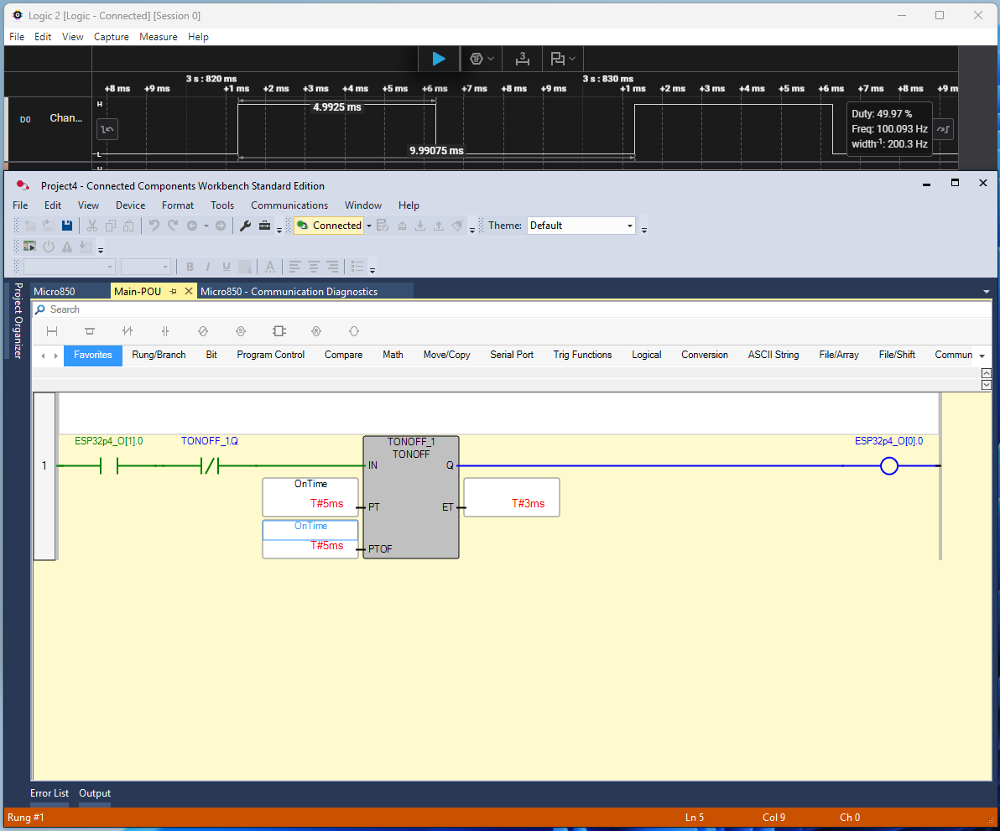

# Test Setup 1 Results

## Overview
- Screenshot shows the Allen-Bradley Micro850 ladder logic driving `ESP32p4_QT1[0]` through a TON/TOF timer with the Saleae logic analyzer running behind it. The logic analyzer was connected to ESP32-P4 `GPIO_NUM_33`, mapped to byte 0, bit 0 in OpENer.

## Observations
- Ladder timer block (TONOFF) updates the coil `ESP32p4_QT0[0]` with expected 5 ms ON/OFF periods.
- Saleae trace confirms 100 Hz output switching frequency (`≈ 9.99 ms` total period).
- Measured duty cycle 49.97% aligns with programmed 5 ms ton/toff.
- No watchdog trips or jitter artifacts observed during the capture window.

## Detailed Findings
- **Requested Packet Interval (RPI):** The Micro850 EtherNet/IP module was configured with a 5 ms RPI so the I/O assembly updates track the PLC timer cadence.
- **Linear Timer Scaling:** Changing the TON/TOF preset values to 10 ms / 10 ms produced a 50 Hz square wave on the analyzer, and 20 ms / 20 ms yielded 25 Hz. This confirms the end-to-end sampling path remains linear as the requested period increases.
- **RPI Interaction at Short Periods:** During long-duration runs with 5 ms TON/TOF presets and a 5 ms RPI, the Saleae capture shows an occasional mismatch between the PLC timer and the EtherNet/IP producer. Approximately every 10–20 seconds the output exhibits a momentary “stretch” (long OFF, short ON) with a variance under 10 ms. The anomaly has not been definitively tied to the ESP32-P4; it may originate from the Micro850’s scheduler or interaction between the two systems.
- **Mitigation:** Raising either the ladder presets or the RPI above 20 ms eliminates the observed glitch in repeated trials. This likely provides enough margin for the connection object to service each production trigger without overruns.
- **Next Steps:** Log connection manager diagnostics while running at 5 ms to verify whether the production inhibit timer or transport trigger timer is causing the drift. Testing with asynchronous TON/TOF values (e.g., 7 ms / 9 ms) may also help determine if the anomaly correlates to equal-period toggling or simply to the minimum schedule rate.

